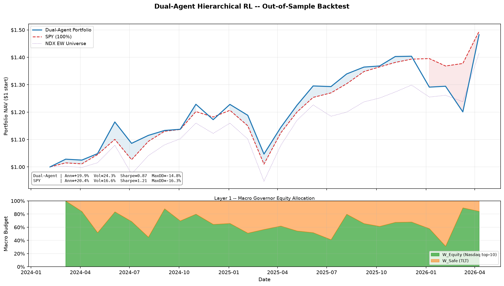

# Dual-Agent Allocator

A Hierarchical Reinforcement Learning (HRL) portfolio manager with two specialised PPO agents that operate on different cadences and different data sources.

**Layer 1 — Macro Governor** runs daily and sets the top-level risk budget: how much capital goes to equities vs. safe harbor (TLT).

**Layer 2 — Micro Selector** runs monthly and, assuming a 100% equity mandate, picks the 10 Nasdaq stocks most likely to outperform the equal-weight benchmark next month.

At each monthly rebalance the two outputs are combined:

```
Final Allocation = W_Equity × (equal-weight top-10 Nasdaq picks)
                + W_Safe   × TLT
```

## Architecture

```
┌─────────────────────────────────────────────────────────┐
│                 LAYER 1: MACRO GOVERNOR                  │
│  Cadence : Daily                                         │
│  Input   : 5 macro features (SPY, TLT, VIX, TNX, IRX,  │
│            DBC → Macro_Trend, Vol_Shock, Yield_Spread,  │
│            Bond_Eq_Corr, Inflation_Trend)                │
│  Output  : W_Equity  ←→  W_Safe  (sum = 1)              │
│  Mapping : W_Eq = (action + 1) / 2  [linear, not        │
│            softmax — preserves 0% and 100% extremes]     │
└──────────────────────┬──────────────────────────────────┘
                       │ W_Equity budget scalar
┌──────────────────────▼──────────────────────────────────┐
│                 LAYER 2: MICRO SELECTOR                  │
│  Cadence : Monthly                                       │
│  Input   : (N_Tickers × 5) cross-sectional feature      │
│            matrix — Mom_90, Stretch, Downside_Var,       │
│            CMF, StochRSI — z-scored across universe      │
│  Output  : Score logit per stock → Top-10 by argsort    │
│  Universe: ~73 Nasdaq stocks (survival-filtered)         │
└─────────────────────────────────────────────────────────┘
```

## Macro Features (Layer 1)

| Feature | Formula |
|---|---|
| `Macro_Trend` | `(SPY − SMA200_SPY) / SMA200_SPY` |
| `Vol_Shock` | `VIX / SMA21_VIX` |
| `Yield_Spread` | `TNX − IRX` (10Y − 3M yield spread) |
| `Bond_Eq_Corr` | 63-day rolling Pearson corr(SPY_ret, TLT_ret) |
| `Inflation_Trend` | `(DBC − SMA200_DBC) / SMA200_DBC` |

## Micro Features (Layer 2)

| Feature | Formula |
|---|---|
| `Mom_90` | 90-day price return |
| `Stretch` | `(Close − SMA50) / SMA50` |
| `Downside_Var` | 30-day rolling std of negative-only daily returns |
| `CMF` | 20-day Chaikin Money Flow |
| `StochRSI` | 14-day Stochastic RSI k-line |

All five features are cross-sectionally z-scored per date so the model sees relative signals, not absolute price levels.

## Personas

Behaviour is controlled entirely by JSON configs — no code changes needed.

| Config | `lambda_variance` | `lambda_drawdown` | `max_turnover` | Character |
|---|:-:|:-:|:-:|---|
| `baseline_conservative.json` | 0.50 | 1.00 | 10% | Low variance, drawdown-averse |
| `aggressive_macro.json` | 0.10 | 0.50 | 15% | Sharper rotational bets |

The reward function is:

```
R = portfolio_return
    − λ_variance  × rolling_21d_variance
    − λ_drawdown  × current_drawdown_depth
    − turnover_friction
```

`max_turnover` is a hard structural constraint applied before the reward — not just a penalty.

## Out-of-Sample Results

Backtest window: **March 2024 – April 2026** (26 months, chronological 15% holdout — never seen during training).



| | Dual-Agent | SPY (100%) |
|---|:-:|:-:|
| **Ann. Return** | +19.9% | +20.4% |
| **Ann. Volatility** | 24.3% | 16.6% |
| **Sharpe Ratio** | 0.87 | 1.21 |
| **Max Drawdown** | −14.8% | −16.3% |

**Top panel** — equity curves from a $1.00 starting NAV. Blue shading = dual-agent outperforming SPY; red shading = underperforming. The portfolio closely tracks SPY for most of the window, with a notable divergence in early 2026 driven by the Macro Governor rotating heavily into equities.

**Bottom panel** — Layer 1's daily W_Equity allocation. The agent dynamically varies its equity exposure between ~40% and ~100%, cutting risk during macro stress periods (e.g. mid-2024 volatility, early 2025 drawdown) and pressing risk-on when the regime is favourable.

> Returns are comparable to a 100% SPY position but achieved with a concentrated 10-stock Nasdaq selection layered on top of a dynamic TLT hedge — the portfolio is not trying to beat SPY on risk-adjusted terms; it is demonstrating that the HRL framework learns a coherent macro + micro signal.

## Setup

```bash
python -m venv .venv
.venv\Scripts\activate        # Linux/Mac: source .venv/bin/activate
pip install -r requirements.txt
```

## Pipeline

### 1. Build data caches

```bash
# Layer 1: downloads 6 macro proxies, engineers 5 features → data/macro_data.parquet
python data_loader.py

# Layer 2: downloads ~73 Nasdaq tickers, engineers 5 features → data/layer2_states.npy
python data_loader_layer2.py
```

Both scripts use `curl_cffi` with Chrome impersonation to bypass Yahoo Finance rate-limits. Data is cached so training never re-fetches the same rows.

### 2. Train

```bash
# Layer 1 — Macro Governor
python train.py --config configs/aggressive_macro.json
python train.py --config configs/baseline_conservative.json

# Layer 2 — Micro Selector (exploits 32-thread CPUs via SubprocVecEnv)
python train_layer2.py
```

Optional training flags:

```bash
python train.py --config configs/aggressive_macro.json --timesteps 200000 --n-envs 8 --seed 0
python train.py --config configs/aggressive_macro.json --eval        # train then evaluate
python train.py --config configs/aggressive_macro.json --eval-only   # skip training
```

### 3. Evaluate out-of-sample

Runs the combined dual-agent system over the chronological 15% holdout, prints monthly returns vs. SPY and NDX equal-weight benchmarks, and saves a chart.

```bash
python evaluate_dual_agent.py
# → results/dual_agent_backtest.png
# → results/dual_agent_backtest.csv
```

### 4. Live inference

Downloads today's market data, runs both frozen policies, and prints a trading ticket for the current month.

```bash
python live_inference.py
```

Example output:

```
=========================================
LIVE DUAL-AGENT INFERENCE (Date: 2026-06-27)

MACRO GOVERNOR (Layer 1):

  Target Equity Weight : 72.4%

  Target Safe Weight   : 27.6% (TLT / Cash)

MICRO SELECTOR (Layer 2) - TOP 10 BUYS:

  NVDA

  MSFT
  ...

  CRWD

=========================================
```

### 5. Monitor training

```bash
tensorboard --logdir logs/
```

## Project Structure

```
configs/
  aggressive_macro.json         ← persona: high risk tolerance
  baseline_conservative.json    ← persona: drawdown-averse

data_loader.py                  ← Layer 1 macro data pipeline
data_loader_layer2.py           ← Layer 2 micro data pipeline

envs/
  layer1_macro_env.py           ← Gymnasium env: daily macro allocation
  layer2_micro_env.py           ← Gymnasium env: monthly stock ranking

train.py                        ← Layer 1 PPO training
train_layer2.py                 ← Layer 2 PPO training (SubprocVecEnv)

evaluate_dual_agent.py          ← Combined OOS backtest + chart
live_inference.py               ← Production trading ticket generator

requirements.txt
```

Generated at runtime (gitignored): `data/`, `models/`, `logs/`, `results/`

## Artifact Layout

```
models/
  layer1_{exp_name}_policy.zip          ← frozen Layer 1 policy
  layer1_{exp_name}_vec_normalise.pkl   ← Layer 1 VecNormalize stats
  layer2_micro_policy.zip               ← frozen Layer 2 policy
  layer2_vec_normalise.pkl              ← Layer 2 VecNormalize stats
  checkpoints/                          ← periodic snapshots
  best/                                 ← best checkpoint by eval reward
logs/
  PPO_layer1_{exp_name}_N/              ← TensorBoard runs
  PPO_layer2_N/
results/
  dual_agent_backtest.png               ← equity curve chart
  dual_agent_backtest.csv               ← monthly return ledger
data/
  macro_data.parquet                    ← Layer 1 feature cache
  layer2_states.npy                     ← Layer 2 state tensor (Months × Tickers × 5)
  layer2_returns.npy                    ← Layer 2 return tensor (Months × Tickers)
  layer2_meta.json                      ← ordered ticker list + monthly dates
```

> **Important:** Each `.pkl` normaliser is policy-specific. Always load the `.zip` and its matching `.pkl` together. Loading a normaliser from a different training run will produce incorrect observations and silent performance degradation.

## Dependencies

| Package | Role |
|---|---|
| `stable-baselines3` | PPO implementation |
| `gymnasium` | RL environment interface |
| `torch` | Neural network backend |
| `yfinance` | Market data source |
| `curl_cffi` | Chrome-impersonation HTTP — required for reliable downloads |
| `numpy` / `pandas` | Data manipulation |
| `scipy` | Softmax utility |
| `pyarrow` | Parquet read/write |
| `tensorboard` | Training run visualisation |
