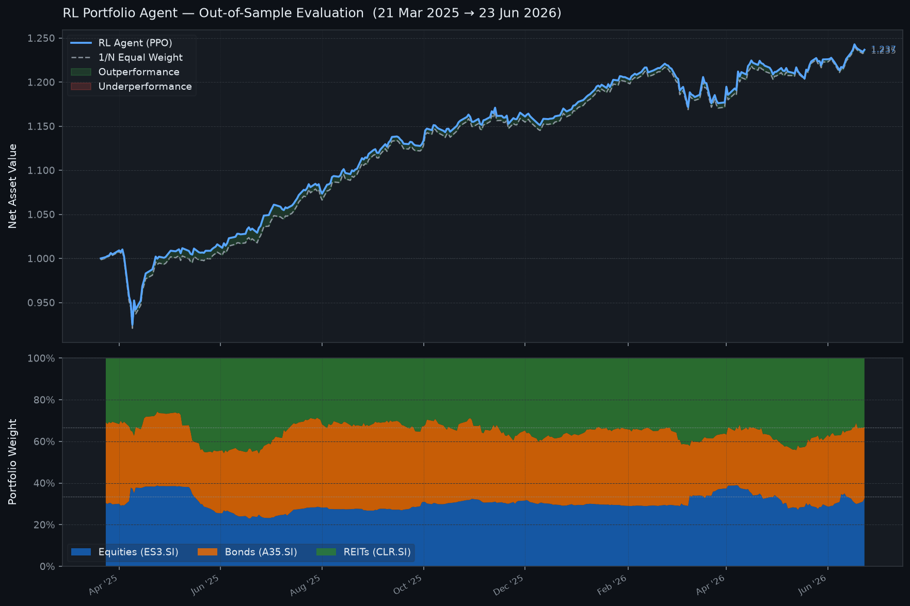

# RL Portfolio Optimizer

A reinforcement learning portfolio manager trained on three Singapore-listed ETFs using Proximal Policy Optimization (PPO). The agent learns a daily rebalancing policy that maximises risk-adjusted compounding returns under explicit turnover and drawdown constraints.

## Asset Universe

| Ticker | Asset | Characteristics |
|--------|-------|----------------|
| ES3.SI | SPDR STI ETF | SG equities, ~15yr history, ~3% yield |
| A35.SI | ABF Singapore Bond Index Fund | SG government bonds |
| CLR.SI | Lion-Phillip S-REIT ETF | S-REITs, inception ~2017 |

## Results (Baseline Conservative, out-of-sample Mar 2025 – Jun 2026)

The agent outperforms a daily-rebalanced 1/N equal-weight benchmark across the test window, achieving a final NAV of ~1.235 vs ~1.185 for the benchmark while maintaining lower drawdown through a persistent tilt toward REITs and bonds.



## Setup

```bash
python -m venv .venv
source .venv/bin/activate      # Windows: .venv\Scripts\activate
pip install -r requirements.txt

# Fetch 15 years of daily market data (cached to data/market_data.parquet)
python data_loader.py
```

## Usage

**Train a persona:**
```bash
python train.py --config configs/baseline_conservative.json
python train.py --config configs/aggressive_macro.json
```

**Evaluate out-of-sample (opens interactive chart in browser):**
```bash
python evaluate.py --config configs/baseline_conservative.json
```

**Compare personas in TensorBoard:**
```bash
tensorboard --logdir logs/
```

## Personas

Reward hyperparameters are stored in `configs/` and passed to the environment at runtime — no code changes needed to experiment with different risk profiles.

| Config | `lambda_variance` | `lambda_drawdown` | `max_turnover` | Character |
|--------|:-----------------:|:-----------------:|:--------------:|-----------|
| `baseline_conservative.json` | 0.50 | 1.00 | 10% | Hugs the index, avoids deep losses |
| `aggressive_macro.json` | 0.10 | 0.50 | 15% | Sharper rotational bets, higher variance tolerance |

To add a new persona, create a new JSON in `configs/` with the four required fields: `experiment_name`, `max_turnover`, `lambda_variance`, `lambda_drawdown`, `transaction_costs`.

## How It Works

**Observation (13-dim):** 21-day vol × 3, 63-day vol × 3, 63-day momentum × 3, S-REIT yield spread, current weights × 3.

**Action:** Raw 3-dim logits → softmax projection guarantees `∑w = 1, w ≥ 0` without clipping. A turnover clamp is applied before execution as a hard structural constraint (independent of the reward signal).

**Reward:** `portfolio_return − λ_variance × rolling_variance − λ_drawdown × drawdown_depth − transaction_costs`

**Training:** PPO with 4 parallel workers sampling random 252-day episodes. `VecNormalize` maintains running observation statistics. The last 15% of the dataset (chronological) is held out as a test set and never seen during training.

## Project Structure

```
configs/          Experiment hyperparameter files (one per persona)
data_loader.py    Downloads prices from yfinance, engineers features, caches to parquet
sg_portfolio_env.py  Gymnasium environment — state, action, reward logic
train.py          PPO training loop with checkpointing and eval callbacks
evaluate.py       Deterministic out-of-sample rollout with interactive Plotly chart
requirements.txt
```

Generated at runtime (gitignored): `data/`, `models/`, `logs/`, `results/`

## Dependencies

`curl_cffi` is required for reliable `.SI` ticker downloads. Without it, Yahoo Finance's JA3/JA4 bot-detection rate-limits Singapore tickers aggressively. See `requirements.txt`.
