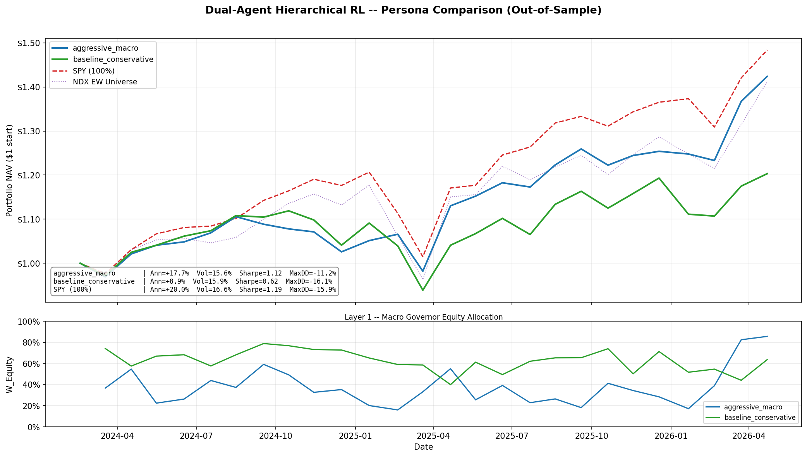

# Dual-Agent Allocator

A Hierarchical Reinforcement Learning (HRL) portfolio manager with two specialised PPO agents that operate on different cadences and different data sources.

**Layer 1 — Macro Governor** runs daily and sets the top-level risk budget: how much capital goes to equities vs. safe harbor (TLT).

**Layer 2 — Micro Selector** runs monthly and, assuming a 100% equity mandate, picks the 10 Nasdaq stocks most likely to outperform the equal-weight benchmark next month.

At each monthly rebalance the two outputs are combined:

```text
Final Allocation = W_Equity × (equal-weight top-10 Nasdaq picks)
                + W_Safe   × TLT
```

## Architecture

```text
┌─────────────────────────────────────────────────────────┐
│                 LAYER 1: MACRO GOVERNOR                  │
│  Cadence : Daily                                         │
│  Input   : 5 macro features (SPY, TLT, VIX, TNX, IRX,  │
│            DBC → Macro_Trend, Vol_Shock, Yield_Spread,  │
│            Bond_Eq_Corr, Inflation_Trend)                │
│  Output  : W_Equity  ←→  W_Safe  (sum = 1)              │
│  Mapping : W_Eq = (action + 1) / 2  [linear, not        │
│            softmax — preserves 0% and 100% extremes]     │
└──────────────────────┬──────────────────────────────────┘
                       │ W_Equity budget scalar
┌──────────────────────▼──────────────────────────────────┐
│                 LAYER 2: MICRO SELECTOR                  │
│  Cadence : Monthly                                       │
│  Input   : (N_Tickers × 5) cross-sectional feature      │
│            matrix — Mom_90, Stretch, Downside_Var,       │
│            CMF, StochRSI — z-scored across universe      │
│  Output  : Score logit per stock → Top-10 by argsort    │
│  Universe: ~73 Nasdaq stocks (survival-filtered)         │
└─────────────────────────────────────────────────────────┘
```

## Macro Features (Layer 1)

| Feature | Formula |
| --- | --- |
| `Macro_Trend` | `(SPY − SMA200_SPY) / SMA200_SPY` |
| `Vol_Shock` | `VIX / SMA21_VIX` |
| `Yield_Spread` | `TNX − IRX` (10Y − 3M yield spread) |
| `Bond_Eq_Corr` | 63-day rolling Pearson corr(SPY_ret, TLT_ret) |
| `Inflation_Trend` | `(DBC − SMA200_DBC) / SMA200_DBC` |

## Micro Features (Layer 2)

| Feature | Formula |
| --- | --- |
| `Mom_90` | 90-day price return |
| `Stretch` | `(Close − SMA50) / SMA50` |
| `Downside_Var` | 30-day rolling std of negative-only daily returns |
| `CMF` | 20-day Chaikin Money Flow |
| `StochRSI` | 14-day Stochastic RSI k-line |

All five features are cross-sectionally z-scored per date so the model sees relative signals, not absolute price levels.

## Personas

Behaviour is controlled entirely by JSON configs — no code changes needed.

| Config | `lambda_variance` | `lambda_drawdown` | `max_turnover` | Character |
| --- | :-: | :-: | :-: | --- |
| `baseline_conservative.json` | 0.50 | 1.00 | 10% | Low variance, drawdown-averse |
| `aggressive_macro.json` | 0.10 | 0.50 | 15% | Sharper rotational bets |

The reward function is:

```text
R = portfolio_return
    − λ_variance  × rolling_21d_variance
    − λ_drawdown  × current_drawdown_depth
    − turnover_friction
```

`max_turnover` is a hard structural constraint applied before the reward — not just a penalty.

## Out-of-Sample Results

Backtest window: **March 2024 – April 2026** (26 months, chronological 15% holdout — never seen during training). Both personas share the same Layer 2 stock picks (the Micro Selector is persona-independent); they differ only in Layer 1's equity/safe budget.



| | `aggressive_macro` | `baseline_conservative` | SPY (100%) |
| --- | :-: | :-: | :-: |
| **Ann. Return** | +17.7% | +8.9% | +20.0% |
| **Ann. Volatility** | 15.6% | 15.9% | 16.6% |
| **Sharpe Ratio** | **1.12** | 0.62 | 1.19 |
| **Max Drawdown** | −11.2% | −16.1% | −15.9% |

**Top panel** — equity curves from a $1.00 starting NAV, one line per persona plus the SPY and NDX equal-weight benchmarks.

**Bottom panel** — each persona's Layer 1 W_Equity allocation over time.

> The `aggressive_macro` persona is the stronger OOS performer — nearly double the return of `baseline_conservative` at a comparable volatility, with a *smaller* drawdown and a Sharpe close to SPY's. The bottom panel shows why: it actively cuts equity to ~15–20% through the early-2025 drawdown and ramps to ~85% into the 2026 rally, whereas `baseline_conservative` stays passively ~50–75% invested and rides the drawdowns. The point is not to beat SPY on risk-adjusted terms but to show the HRL framework learns a coherent, regime-aware macro + micro signal — and that reward shaping (the persona configs) materially changes the learned risk timing.

## Setup

```bash
python -m venv .venv
.venv\Scripts\activate        # Linux/Mac: source .venv/bin/activate
pip install -r requirements.txt
```

## Pipeline

### 1. Build data caches

```bash
# Layer 1: downloads 6 macro proxies, engineers 5 features → data/macro_data.parquet
python data_loader.py

# Layer 2: downloads ~73 Nasdaq tickers, engineers 5 features → data/layer2_states.npy
python data_loader_layer2.py
```

Both scripts use `curl_cffi` with Chrome impersonation to bypass Yahoo Finance rate-limits. Data is cached so training never re-fetches the same rows.

### 2. Train

```bash
# Layer 1 — Macro Governor
python train.py --config configs/aggressive_macro.json
python train.py --config configs/baseline_conservative.json

# Layer 2 — Micro Selector (exploits 32-thread CPUs via SubprocVecEnv)
python train_layer2.py
```

Optional training flags:

```bash
python train.py --config configs/aggressive_macro.json --timesteps 200000 --n-envs 8 --seed 0
python train.py --config configs/aggressive_macro.json --eval        # train then evaluate
python train.py --config configs/aggressive_macro.json --eval-only   # skip training
```

### 3. Evaluate out-of-sample

Runs the combined dual-agent system over the chronological 15% holdout, prints monthly returns vs. SPY and NDX equal-weight benchmarks, and saves a chart. `--config` is required and selects the Layer 1 persona; pass two or more to overlay them on a comparison chart.

```bash
# Single persona
python evaluate_dual_agent.py --config configs/aggressive_macro.json
# → results/dual_agent_backtest.png
# → results/dual_agent_backtest.csv

# Compare personas on one chart
python evaluate_dual_agent.py --config configs/aggressive_macro.json configs/baseline_conservative.json
# → results/dual_agent_comparison.png
# → results/dual_agent_comparison.csv
```

### 4. Live inference

Downloads today's market data, runs both frozen policies, prints a trading ticket for the current month, and saves it as a Markdown report.

```bash
# Single persona
python live_inference.py --config configs/aggressive_macro.json
python live_inference.py --config configs/baseline_conservative.json

# Compare personas in one run
python live_inference.py --config configs/aggressive_macro.json configs/baseline_conservative.json
```

`--config` is **required** (like `train.py`) and selects the Layer 1 persona — the policy and normaliser are resolved from the config's `experiment_name`. Layer 2 is persona-independent, so the persona choice only changes the equity/safe budget, never the stock picks. Passing two or more configs downloads the live data and runs the stock selection **once**, then reports each persona's macro budget against the shared Top-10.

Example output (comparison mode):

```text
=========================================
LIVE DUAL-AGENT INFERENCE (Date: 2026-07-08)

MACRO GOVERNOR (Layer 1) - EQUITY / SAFE BUDGET:

  aggressive_macro         Equity 13.8%   Safe 86.2% (TLT / Cash)
  baseline_conservative    Equity 55.2%   Safe 44.8% (TLT / Cash)

MICRO SELECTOR (Layer 2) - TOP 10 BUYS (shared):

  IDXX
  DXCM
  ...
  INTU

=========================================

Report written to: results/trading_ticket_2026-07-08_comparison.md
```

Reports are written to `results/`:

- Single persona → `trading_ticket_{date}_{persona}.md` (persona in the filename so same-date tickets don't overwrite each other).
- Multiple personas → `trading_ticket_{date}_comparison.md`.

### 5. Monitor training

```bash
tensorboard --logdir logs/
```

## Project Structure

```text
configs/
  aggressive_macro.json         ← persona: high risk tolerance
  baseline_conservative.json    ← persona: drawdown-averse

data_loader.py                  ← Layer 1 macro data pipeline
data_loader_layer2.py           ← Layer 2 micro data pipeline

envs/
  layer1_macro_env.py           ← Gymnasium env: daily macro allocation
  layer2_micro_env.py           ← Gymnasium env: monthly stock ranking

train.py                        ← Layer 1 PPO training
train_layer2.py                 ← Layer 2 PPO training (SubprocVecEnv)

evaluate_dual_agent.py          ← Combined OOS backtest + chart
live_inference.py               ← Production trading ticket generator

requirements.txt
```

Generated at runtime (gitignored): `data/`, `models/`, `logs/`, `results/`

## Artifact Layout

```text
models/
  layer1_{exp_name}_policy.zip          ← frozen Layer 1 policy
  layer1_{exp_name}_vec_normalise.pkl   ← Layer 1 VecNormalize stats
  layer2_micro_policy.zip               ← frozen Layer 2 policy
  layer2_vec_normalise.pkl              ← Layer 2 VecNormalize stats
  checkpoints/                          ← periodic snapshots
  best/                                 ← best checkpoint by eval reward
logs/
  PPO_layer1_{exp_name}_N/              ← TensorBoard runs
  PPO_layer2_N/
results/
  dual_agent_backtest.png               ← single-persona equity curve chart
  dual_agent_backtest.csv               ← single-persona monthly ledger
  dual_agent_comparison.png             ← multi-persona comparison chart
  dual_agent_comparison.csv             ← multi-persona monthly ledger
  trading_ticket_{date}_{persona}.md    ← live inference ticket (single persona)
  trading_ticket_{date}_comparison.md   ← live inference ticket (multi-persona)
data/
  macro_data.parquet                    ← Layer 1 feature cache
  layer2_states.npy                     ← Layer 2 state tensor (Months × Tickers × 5)
  layer2_returns.npy                    ← Layer 2 return tensor (Months × Tickers)
  layer2_meta.json                      ← ordered ticker list + monthly dates
```

> **Important:** Each `.pkl` normaliser is policy-specific. Always load the `.zip` and its matching `.pkl` together. Loading a normaliser from a different training run will produce incorrect observations and silent performance degradation.

## Dependencies

| Package | Role |
| --- | --- |
| `stable-baselines3` | PPO implementation |
| `gymnasium` | RL environment interface |
| `torch` | Neural network backend |
| `yfinance` | Market data source |
| `curl_cffi` | Chrome-impersonation HTTP — required for reliable downloads |
| `numpy` / `pandas` | Data manipulation |
| `scipy` | Softmax utility |
| `pyarrow` | Parquet read/write |
| `tensorboard` | Training run visualisation |
